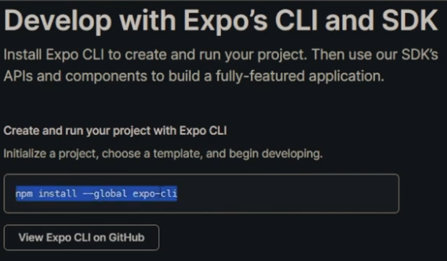
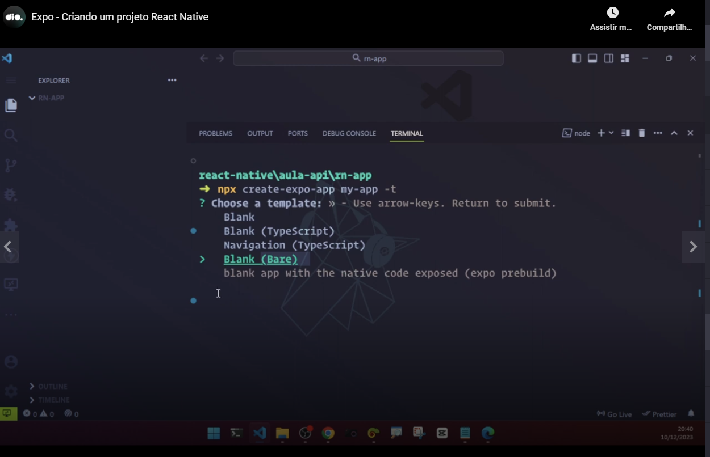
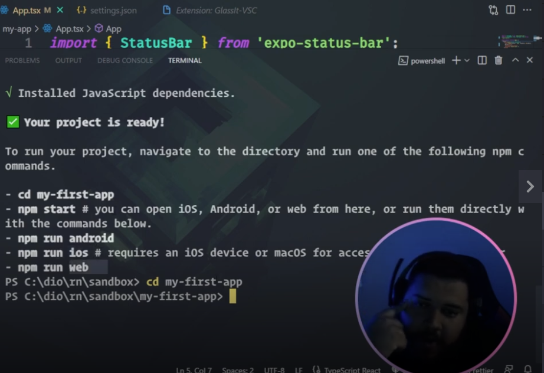
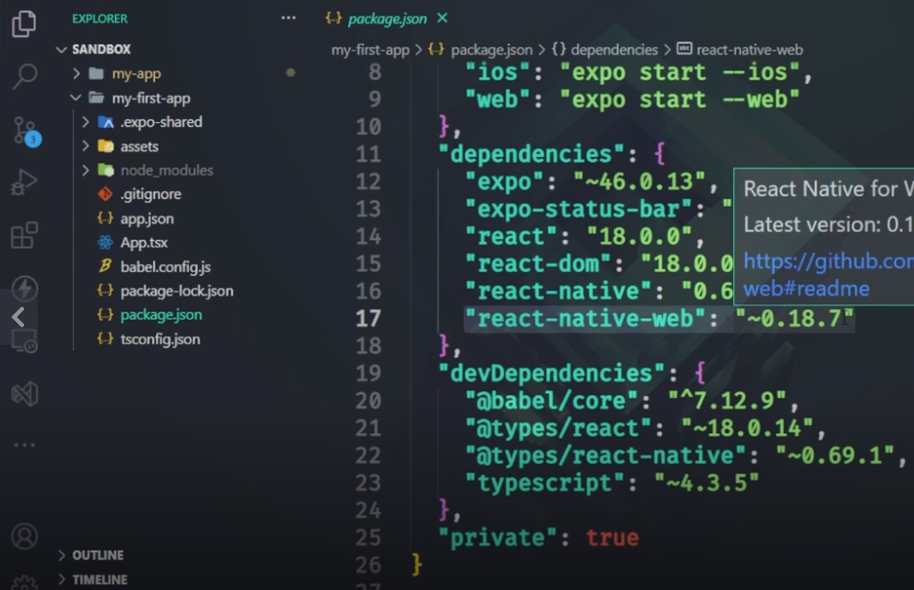
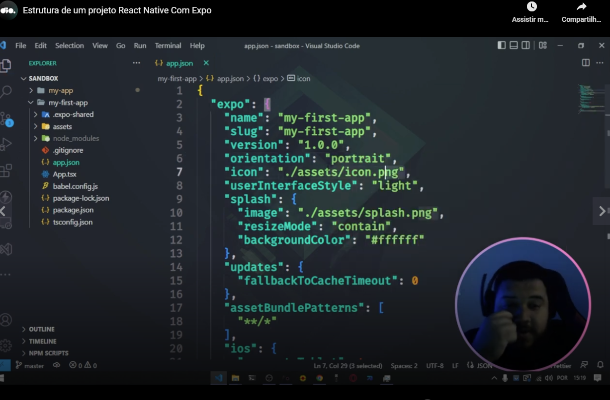
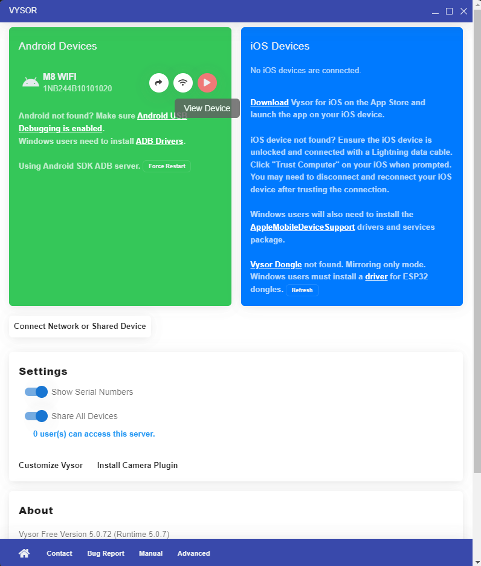

# Installing Expo



Teacher daid that we will see a lot of warnings when installing Expo because its use a lot of packages in a version that is not a latest version of the package.


# Creating a React Native project in Expo



We will use the template "Blank (TypeScript)" (from te previous image) in the course.




# package.json of an empty project



Small observations:

- we have a package related to Babel;
- we have a package related to Expo. We will not use Expo only to create and debug the app. We will use a package related to Expo.


# Other comments



I will make comments about some files, not all files.

- **App.tsx**: initial script of the app;
- **app.json**: some configurations related to the app.


# Running the app

Teacher instructed us to run the project with the following command:

```
npm run start
```

or

```
expo start
```

In the screen teacher pressed 'w' to see the app on the web.

He also instructed us to download the Expo app in Google Play to see the app in an Android cellphone.

Then using this app teacher instructed us to scan the QR Code provided by the command `npm run start`.


# Summary that we studied until now

- Please install the expo App;
- Please do this instalation globally: `npm install --global expo-cli`;
- Please create the expo app: `npx create-expo-app my-app`. **Attention:** is "create-**expo**-app" and not "create-**react**-app;
- Choose the template, as example "Blank (TypeScript)";
- Enter in the create directory (`cd my-app`);
- Run the app: `npm run start`;
- Now you will can see the app in the browser typing "w" or scan the QR code in the Expo. To see the project on the browser was needed to stop the app, install some packages with the command `npx expo install react-dom react-native-web @expo/metro-runtime` and run the app again;
- One comment: please wait the app in the cellphone or tablet be full loaded to see the right content of the app. In the beggining I saw an icon, but after the app was loaded I saw a text that was in App.tsx;


# Live reload

Teacher changed the text o the blank app, saved and the text changed in the cellphone. In my text this was not ocurred, I needed to stop the app and run again, I think I did not wait a sufficient time only, but no problem, if it was not the case is necessary only run the app again. This is very quick.


# Android Studio and Vysor

Teacher also said that we can install Android Studio to use the debugger, but Android Studio instalator is very big (almost 10 GB). Because of this teacher asked us to install Vysor.


# Expo CLI x React Native CLI

Teacher commented that not all things of the React Native CLI "world" will work on the app created by the Expo CLI, but Expo will save you from some headaches like install Android Studio.

He also commented that you can migrate an app created using Expo CLI to a React **Native** app (see the word **Native** app). You have to find by "expo eject" in Google. 

And teacher commented that Expo is amazing and he use it nowdays, but if he needs to start a project and in this project he has a lot of doubts, probably he would install Android Studio and would use use React **Native** CLI. This option because Expo not works very well with some third part tools or components.

It was simple. I only needed to [enable the developer options in the tablet](https://learn.microsoft.com/pt-br/dotnet/maui/android/device/setup?view=net-maui-9.0). 

Then I could identify my as deveoper in the tablet using an option in deveoper options of the tablet.

After scanning the QR Code on Expo app I could see the app in the tablet.

I already had Android Studio installed in the computer. Then I could run `adb devices` and in the output I could see the identification of the tablet.

Vysior has a "play button" on its screen. And when I clicked in this option I could see the app that I saw in the tablet (the active window on the tablet)



In real I could see the exact main window of the tablet, the developer app or other app and interact with this app using the mouse.


# Using an Android emulator and the app created

You have to run a emulator on Android Studio.

Remember, to run the app you have to run `npm run start`.

In the screen related to the app running, you can press "a".

Now you will see the app on the emulator.


# Links passed in complementary materials section

[Expo Go](https://expo.dev/go)